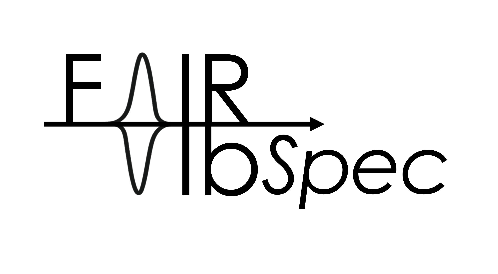

# FAIRVibSpec

  

Toolkit for analysis, visualization and data management of vibrational spectroscopy data.

## 🛠️ What is FAIRVibSpec?

FAIRVibSpec presents, as of now, a toolkit to process, analyze, fit and plot data obtained from selected vibrational spectroscopy methods, including FT-IR, Py-IR, and Raman spectroscopy. All data, relevant metadata, and analysis steps are stored in a data model based on the [md-models](https://github.com/FAIRChemistry/md-models) Rust library. This data model serves as the central hub for the toolkit, governing the flow of data between the different components and allowing for easy export of structured data to ensure reproducability and FAIRness.

## 📦 Installation

_Coming soon..._

## ⚡️ Quick Start

_Coming soon..._

## ⚖️ License

MIT License

Copyright (c) 2025 FAIRChemistry

Permission is hereby granted, free of charge, to any person obtaining a copy
of this software and associated documentation files (the "Software"), to deal
in the Software without restriction, including without limitation the rights
to use, copy, modify, merge, publish, distribute, sublicense, and/or sell
copies of the Software, and to permit persons to whom the Software is
furnished to do so, subject to the following conditions:

The above copyright notice and this permission notice shall be included in all
copies or substantial portions of the Software.

THE SOFTWARE IS PROVIDED "AS IS", WITHOUT WARRANTY OF ANY KIND, EXPRESS OR
IMPLIED, INCLUDING BUT NOT LIMITED TO THE WARRANTIES OF MERCHANTABILITY,
FITNESS FOR A PARTICULAR PURPOSE AND NONINFRINGEMENT. IN NO EVENT SHALL THE
AUTHORS OR COPYRIGHT HOLDERS BE LIABLE FOR ANY CLAIM, DAMAGES OR OTHER
LIABILITY, WHETHER IN AN ACTION OF CONTRACT, TORT OR OTHERWISE, ARISING FROM,
OUT OF OR IN CONNECTION WITH THE SOFTWARE OR THE USE OR OTHER DEALINGS IN THE
SOFTWARE.
