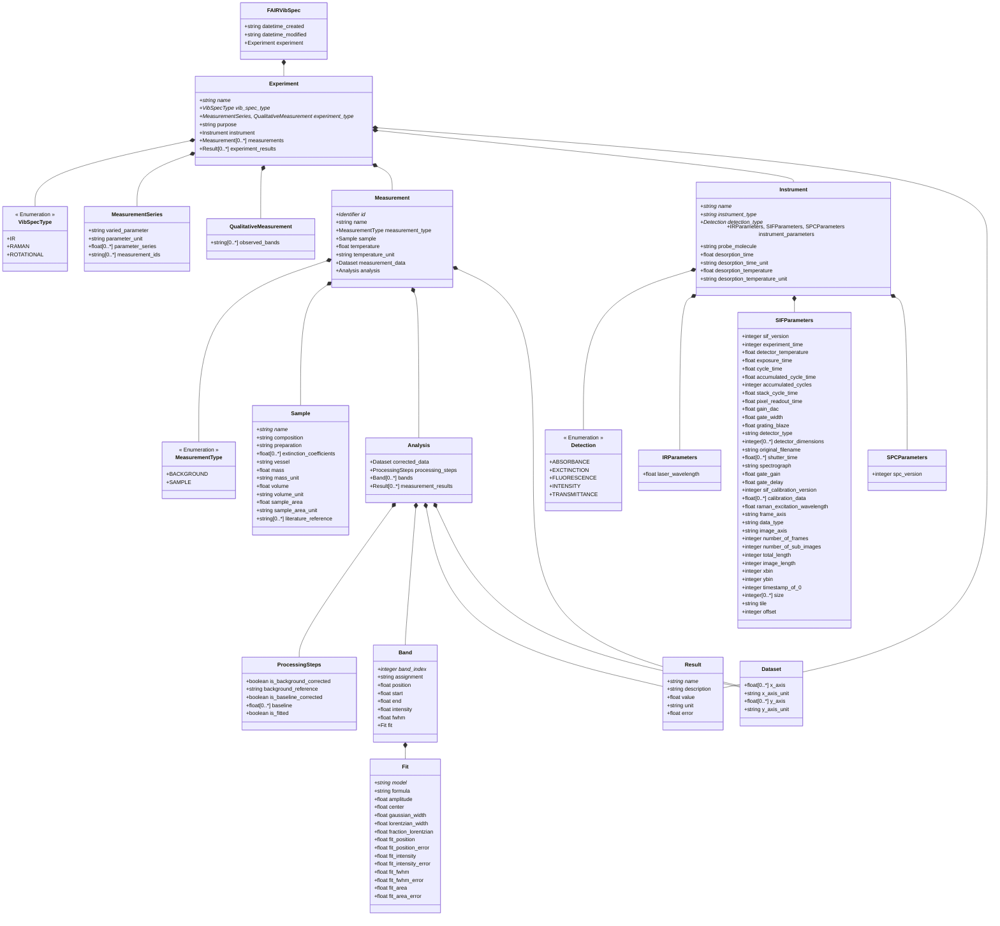

```mermaid
classDiagram
    FAIRVibSpec *-- Experiment
    Experiment *-- VibSpecType
    Experiment *-- MeasurementSeries
    Experiment *-- QualitativeMeasurement
    Experiment *-- Measurement
    Experiment *-- Instrument
    Experiment *-- Result
    Measurement *-- MeasurementType
    Measurement *-- Sample
    Measurement *-- Analysis
    Measurement *-- Dataset
    Instrument *-- Detection
    Instrument *-- IRParameters
    Instrument *-- SIFParameters
    Instrument *-- SPCParameters
    Analysis *-- ProcessingSteps
    Analysis *-- Band
    Analysis *-- Result
    Analysis *-- Dataset
    Band *-- Fit
    
    class FAIRVibSpec {
        +string datetime_created
        +string datetime_modified
        +Experiment experiment
    }
    
    class Experiment {
        +string name*
        +VibSpecType vib_spec_type*
        +MeasurementSeries, QualitativeMeasurement experiment_type*
        +string purpose
        +Instrument instrument
        +Measurement[0..*] measurements
        +Result[0..*] experiment_results
    }
    
    class MeasurementSeries {
        +string varied_parameter
        +string parameter_unit
        +float[0..*] parameter_series
        +string[0..*] measurement_ids
    }
    
    class QualitativeMeasurement {
        +string[0..*] observed_bands
    }
    
    class Measurement {
        +Identifier id*
        +string name
        +MeasurementType measurement_type
        +Sample sample
        +float temperature
        +string temperature_unit
        +Dataset measurement_data
        +Analysis analysis
    }
    
    class Sample {
        +string name*
        +string composition
        +string preparation
        +float[0..*] extinction_coefficients
        +string vessel
        +float mass
        +string mass_unit
        +float volume
        +string volume_unit
        +float sample_area
        +string sample_area_unit
        +string[0..*] literature_reference
    }
    
    class Instrument {
        +string name*
        +string instrument_type*
        +Detection detection_type*
        +IRParameters, SIFParameters, SPCParameters instrument_parameters
        +string probe_molecule
        +float desorption_time
        +string desorption_time_unit
        +float desorption_temperature
        +string desorption_temperature_unit
    }
    
    class IRParameters {
        +float laser_wavelength
    }
    
    class SIFParameters {
        +integer sif_version
        +integer experiment_time
        +float detector_temperature
        +float exposure_time
        +float cycle_time
        +float accumulated_cycle_time
        +integer accumulated_cycles
        +float stack_cycle_time
        +float pixel_readout_time
        +float gain_dac
        +float gate_width
        +float grating_blaze
        +string detector_type
        +integer[0..*] detector_dimensions
        +string original_filename
        +float[0..*] shutter_time
        +string spectrograph
        +float gate_gain
        +float gate_delay
        +integer sif_calibration_version
        +float[0..*] calibration_data
        +float raman_excitation_wavelength
        +string frame_axis
        +string data_type
        +string image_axis
        +integer number_of_frames
        +integer number_of_sub_images
        +integer total_length
        +integer image_length
        +integer xbin
        +integer ybin
        +integer timestamp_of_0
        +integer[0..*] size
        +string tile
        +integer offset
    }
    
    class SPCParameters {
        +integer spc_version
    }
    
    class Analysis {
        +Dataset corrected_data
        +ProcessingSteps processing_steps
        +Band[0..*] bands
        +Result[0..*] measurement_results
    }
    
    class ProcessingSteps {
        +boolean is_background_corrected
        +string background_reference
        +boolean is_baseline_corrected
        +float[0..*] baseline
        +boolean is_fitted
    }
    
    class Band {
        +integer band_index*
        +string assignment
        +float position
        +float start
        +float end
        +float intensity
        +float fwhm
        +Fit fit
    }
    
    class Fit {
        +string model*
        +string formula
        +float amplitude
        +float center
        +float gaussian_width
        +float lorentzian_width
        +float fraction_lorentzian
        +float fit_position
        +float fit_position_error
        +float fit_intensity
        +float fit_intensity_error
        +float fit_fwhm
        +float fit_fwhm_error
        +float fit_area
        +float fit_area_error
    }
    
    class Result {
        +string name*
        +string description
        +float value
        +string unit
        +float error
    }
    
    class Dataset {
        +float[0..*] x_axis
        +string x_axis_unit
        +float[0..*] y_axis
        +string y_axis_unit
    }
    
    class MeasurementType {
        << Enumeration >>
        +BACKGROUND
        +SAMPLE
    }
    
    class Detection {
        << Enumeration >>
        +ABSORBANCE
        +EXCTINCTION
        +FLUORESCENCE
        +INTENSITY
        +TRANSMITTANCE
    }
    
    class VibSpecType {
        << Enumeration >>
        +IR
        +RAMAN
        +ROTATIONAL
    }
    
```