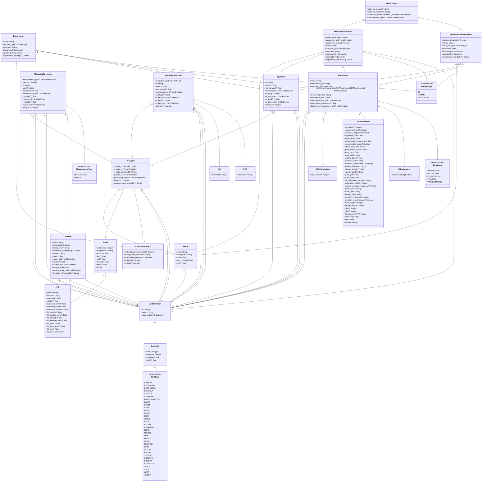

```mermaid
classDiagram
    %% Class definitions with attributes
    class FAIRVibSpec {
        +datetime_created?: string
        +datetime_modified?: string
        +qualitative_measurement?: QualitativeMeasurement
        +measurement_series?: MeasurementSeries
    }

    class Experiment {
        +name: string
        +vib_spec_type: VibSpecType
        +purpose?: string
        +instrument?: Instrument
        +spectra[0..*]: Spectrum
        +experiment_results[0..*]: Result
    }

    class MeasurementSeries {
        +varied_parameter?: string
        +parameter_unit?: UnitDefinition
        +parameter_series[0..*]: float
        +name: string
        +vib_spec_type: VibSpecType
        +purpose?: string
        +instrument?: Instrument
        +spectra[0..*]: Spectrum
        +experiment_results[0..*]: Result
    }

    class QualitativeMeasurement {
        +observed_bands[0..*]: string
        +name: string
        +vib_spec_type: VibSpecType
        +purpose?: string
        +instrument?: Instrument
        +spectra[0..*]: Spectrum
        +experiment_results[0..*]: Result
    }

    class Spectrum {
        +id: string
        +name?: string
        +temperature?: float
        +temperature_unit?: UnitDefinition
        +x_data[0..*]: float
        +x_data_unit?: UnitDefinition
        +y_data[0..*]: float
        +y_data_unit?: UnitDefinition
        +analysis?: Analysis
    }

    class MeasuredSpectrum {
        +measurement_type?: MeasurementType
        +sample?: Sample
        +id: string
        +name?: string
        +temperature?: float
        +temperature_unit?: UnitDefinition
        +x_data[0..*]: float
        +x_data_unit?: UnitDefinition
        +y_data[0..*]: float
        +y_data_unit?: UnitDefinition
        +analysis?: Analysis
    }

    class SimulatedSpectrum {
        +simulation_method?: DFT | MD
        +id: string
        +name?: string
        +temperature?: float
        +temperature_unit?: UnitDefinition
        +x_data[0..*]: float
        +x_data_unit?: UnitDefinition
        +y_data[0..*]: float
        +y_data_unit?: UnitDefinition
        +analysis?: Analysis
    }

    class Sample {
        +name: string
        +composition?: string
        +preparation?: string
        +extinction_coefficients[0..*]: float
        +vessel?: string
        +mass?: float
        +mass_unit?: UnitDefinition
        +volume?: float
        +volume_unit?: UnitDefinition
        +sample_area?: float
        +sample_area_unit?: UnitDefinition
        +literature_reference[0..*]: string
    }

    class DFT {
        +functional?: string
    }

    class MD {
        +forcefield?: string
    }

    class Instrument {
        +name: string
        +instrument_type: string
        +detection_type: Detection
        +instrument_parameters?: IRParameters | SIFParameters | SPCParameters
        +probe_molecule?: string
        +desorption_time?: float
        +desorption_time_unit?: UnitDefinition
        +desorption_temperature?: float
        +desorption_temperature_unit?: UnitDefinition
    }

    class IRParameters {
        +laser_wavelength?: float
    }

    class SIFParameters {
        +sif_version?: integer
        +experiment_time?: integer
        +detector_temperature?: float
        +exposure_time?: float
        +cycle_time?: float
        +accumulated_cycle_time?: float
        +accumulated_cycles?: integer
        +stack_cycle_time?: float
        +pixel_readout_time?: float
        +gain_dac?: float
        +gate_width?: float
        +grating_blaze?: float
        +detector_type?: string
        +detector_dimensions[0..*]: integer
        +original_filename?: string
        +shutter_time[0..*]: float
        +spectrograph?: string
        +gate_gain?: float
        +gate_delay?: float
        +sif_calibration_version?: integer
        +calibration_data[0..*]: float
        +raman_excitation_wavelength?: float
        +frame_axis?: string
        +data_type?: string
        +image_axis?: string
        +number_of_frames?: integer
        +number_of_sub_images?: integer
        +total_length?: integer
        +image_length?: integer
        +xbin?: integer
        +ybin?: integer
        +timestamp_of_0?: integer
        +size[0..*]: integer
        +tile?: string
        +offset?: integer
    }

    class SPCParameters {
        +spc_version?: integer
    }

    class Analysis {
        +x_data_corrected[0..*]: float
        +x_data_unit?: UnitDefinition
        +y_data_corrected[0..*]: float
        +y_data_unit?: UnitDefinition
        +processing_steps?: ProcessingSteps
        +bands[0..*]: Band
        +measurement_results[0..*]: Result
    }

    class ProcessingSteps {
        +is_background_corrected?: boolean
        +background_reference?: string
        +is_baseline_corrected?: boolean
        +baseline[0..*]: float
        +is_fitted?: boolean
    }

    class Band {
        +band_index: integer
        +assignment?: string
        +position?: float
        +start?: float
        +end?: float
        +intensity?: float
        +fwhm?: float
        +fit?: Fit
    }

    class Fit {
        +model: string
        +formula?: string
        +amplitude?: float
        +center?: float
        +gaussian_width?: float
        +lorentzian_width?: float
        +fraction_lorentzian?: float
        +fit_position?: float
        +fit_position_error?: float
        +fit_intensity?: float
        +fit_intensity_error?: float
        +fit_fwhm?: float
        +fit_fwhm_error?: float
        +fit_area?: float
        +fit_area_error?: float
    }

    class Result {
        +name: string
        +description?: string
        +value?: float
        +unit?: UnitDefinition
        +error?: float
    }

    class UnitDefinition {
        +id?: string
        +name?: string
        +base_units[0..*]: BaseUnit
    }

    class BaseUnit {
        +kind: UnitType
        +exponent: integer
        +multiplier?: float
        +scale?: float
    }

    %% Enum definitions
    class MeasurementType {
        <<enumeration>>
        BACKGROUND
        SAMPLE
    }

    class Detection {
        <<enumeration>>
        ABSORBANCE
        EXCTINCTION
        FLUORESCENCE
        INTENSITY
        TRANSMITTANCE
    }

    class VibSpecType {
        <<enumeration>>
        IR
        RAMAN
        ROTATIONAL
    }

    class UnitType {
        <<enumeration>>
        AMPERE
        AVOGADRO
        BECQUEREL
        CANDELA
        CELSIUS
        COULOMB
        DIMENSIONLESS
        FARAD
        GRAM
        GRAY
        HENRY
        HERTZ
        ITEM
        JOULE
        KATAL
        KELVIN
        KILOGRAM
        LITRE
        LUMEN
        LUX
        METRE
        MOLE
        NEWTON
        OHM
        PASCAL
        RADIAN
        SECOND
        SIEMENS
        SIEVERT
        STERADIAN
        TESLA
        VOLT
        WATT
        WEBER
    }

    %% Relationships
    FAIRVibSpec "1" <|-- "1" QualitativeMeasurement
    FAIRVibSpec "1" <|-- "1" MeasurementSeries
    Experiment "1" <|-- "1" VibSpecType
    Experiment "1" <|-- "1" Instrument
    Experiment "1" <|-- "*" Spectrum
    Experiment "1" <|-- "*" Result
    MeasurementSeries "1" <|-- "1" UnitDefinition
    MeasurementSeries "1" <|-- "1" VibSpecType
    MeasurementSeries "1" <|-- "1" Instrument
    MeasurementSeries "1" <|-- "*" Spectrum
    MeasurementSeries "1" <|-- "*" Result
    QualitativeMeasurement "1" <|-- "1" VibSpecType
    QualitativeMeasurement "1" <|-- "1" Instrument
    QualitativeMeasurement "1" <|-- "*" Spectrum
    QualitativeMeasurement "1" <|-- "*" Result
    Spectrum "1" <|-- "1" UnitDefinition
    Spectrum "1" <|-- "1" UnitDefinition
    Spectrum "1" <|-- "1" UnitDefinition
    Spectrum "1" <|-- "1" Analysis
    MeasuredSpectrum "1" <|-- "1" MeasurementType
    MeasuredSpectrum "1" <|-- "1" Sample
    MeasuredSpectrum "1" <|-- "1" UnitDefinition
    MeasuredSpectrum "1" <|-- "1" UnitDefinition
    MeasuredSpectrum "1" <|-- "1" UnitDefinition
    MeasuredSpectrum "1" <|-- "1" Analysis
    SimulatedSpectrum "1" <|-- "1" DFT
    SimulatedSpectrum "1" <|-- "1" MD
    SimulatedSpectrum "1" <|-- "1" UnitDefinition
    SimulatedSpectrum "1" <|-- "1" UnitDefinition
    SimulatedSpectrum "1" <|-- "1" UnitDefinition
    SimulatedSpectrum "1" <|-- "1" Analysis
    Sample "1" <|-- "1" UnitDefinition
    Sample "1" <|-- "1" UnitDefinition
    Sample "1" <|-- "1" UnitDefinition
    Instrument "1" <|-- "1" Detection
    Instrument "1" <|-- "1" IRParameters
    Instrument "1" <|-- "1" SIFParameters
    Instrument "1" <|-- "1" SPCParameters
    Instrument "1" <|-- "1" UnitDefinition
    Instrument "1" <|-- "1" UnitDefinition
    Analysis "1" <|-- "1" UnitDefinition
    Analysis "1" <|-- "1" UnitDefinition
    Analysis "1" <|-- "1" ProcessingSteps
    Analysis "1" <|-- "*" Band
    Analysis "1" <|-- "*" Result
    Band "1" <|-- "1" Fit
    Result "1" <|-- "1" UnitDefinition
    UnitDefinition "1" <|-- "*" BaseUnit
    BaseUnit "1" <|-- "1" UnitType
```